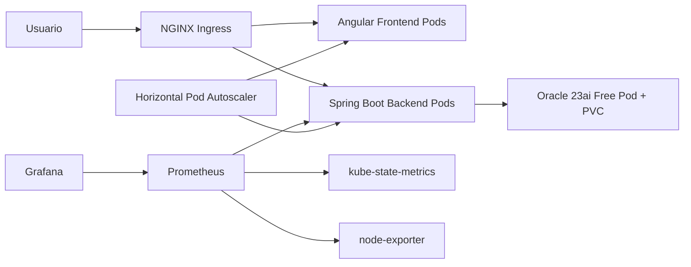

# Airport Platform DevOps/SRE

Plataforma empresarial de aeropuerto para proyecto universitario DevOps/SRE/Kubernetes. Incluye backend Java 21 Spring Boot 3, frontend Angular 19, Oracle Database 23ai Free, Docker, Kubernetes, NGINX Ingress, Prometheus, Grafana, node-exporter, kube-state-metrics, HPA, probes, scripts operativos y GitHub Actions.

## Funcionalidades

- Portal público de vuelos.
- Registro/login con JWT y BCrypt.
- Roles `ADMIN` y `CLIENT`.
- Compra de boletos, reservas y pago simulado.
- Ticket PDF térmico con QR.
- Historial de compras.
- Dashboard cliente.
- Dashboard administrador.
- CRUD de aeropuertos, aviones y vuelos.
- Flyway crea toda la base Oracle automáticamente.
- Swagger: `/swagger-ui.html`.

## Arquitectura



## Estructura

```text
backend/                  Spring Boot 3 Java 21
frontend/                 Angular 19 standalone + Material
k8s/                      Manifiestos Kubernetes completos
observability/            Prometheus y Grafana local
scripts/                  Automatización Bash para VPS/SRE
.github/workflows/        CI/CD GitHub Actions
docs/                     Arquitectura, runbook y troubleshooting
```

## Local con Docker Compose

```powershell
cp .env.example .env
docker compose up --build
```

Servicios:

- Frontend: `http://localhost:8081`
- Backend: `http://localhost:8080`
- Swagger: `http://localhost:8080/swagger-ui.html`
- Prometheus: `http://localhost:9090`
- Grafana: `http://localhost:3000` (`admin/admin123`)
- Oracle host port: `localhost:1522/FREEPDB1`

Nota: Oracle 23ai Free puede fallar en Docker Desktop Windows/WSL2 con `Segmentation fault`. El objetivo real del proyecto es Oracle Linux 10 sobre VPS. Ver [troubleshooting](docs/troubleshooting.md).

## Credenciales Demo

- Admin email: `admin@airport.local`
- Admin password: `Admin12345!`

## Kubernetes en 2 VPS Oracle Linux

Topología recomendada:

- VPS 1: control-plane, NGINX Ingress, frontend/backend/prometheus/grafana.
- VPS 2: worker, Oracle DB con PVC local o storage class persistente.

### 1. Preparar Oracle Linux

En ambos VPS:

```bash
chmod +x scripts/*.sh
./scripts/bootstrap-oracle-linux.sh
```

### 2. Instalar Kubernetes con k3s

En control-plane:

```bash
./scripts/install-k3s-control-plane.sh
```

En worker, usa el token mostrado:

```bash
./scripts/install-k3s-worker.sh https://CONTROL_PLANE_IP:6443 NODE_TOKEN
```

### 3. Instalar NGINX Ingress

```bash
./scripts/install-nginx-ingress.sh
```

### 4. Instalar metrics-server para HPA

```bash
kubectl apply -f https://github.com/kubernetes-sigs/metrics-server/releases/latest/download/components.yaml
kubectl top nodes
```

### 5. Configurar imágenes

Edita:

- `k8s/backend-deployment.yaml`
- `k8s/frontend-deployment.yaml`

Cambia:

```text
ghcr.io/YOUR_ORG/airport-backend:1.0.0
ghcr.io/YOUR_ORG/airport-frontend:1.0.0
```

por tus imágenes reales de GHCR.

### 6. Configurar secretos

Edita `k8s/secrets.yaml` antes de producción:

```text
ORACLE_PASSWORD
DB_PASSWORD
JWT_SECRET
ADMIN_PASSWORD
GRAFANA_ADMIN_PASSWORD
```

### 7. Desplegar

```bash
./scripts/deploy.sh
```

Validar:

```bash
./scripts/health-check.sh
kubectl -n airport get pods -o wide
kubectl -n airport get hpa
kubectl -n airport get ingress
```

## Dominios Ingress

Configura DNS hacia el LoadBalancer/IP del Ingress:

- `airport.example.com`
- `grafana.airport.example.com`
- `prometheus.airport.example.com`

Cambia esos hosts en `k8s/ingress.yaml`.

## Observabilidad

Prometheus recolecta:

- `/actuator/prometheus` del backend.
- Métricas de pods por annotations.
- kube-state-metrics.
- node-exporter.
- Prometheus self metrics.

Grafana incluye dashboards:

- Application Dashboard.
- Kubernetes Cluster Dashboard.
- Node Dashboard.

Alertas incluidas:

- Pod caído.
- Deployment sin replicas.
- CPU alta.
- RAM alta.
- HTTP 500 alto.
- Servicio caído.

## SRE y Simulación

Simular caída de pod:

```bash
./scripts/simulate-failure.sh backend
./scripts/simulate-failure.sh frontend
```

Kubernetes debe recrear pods automáticamente.

Reiniciar deployments:

```bash
./scripts/restart-services.sh
```

Backups:

```bash
./scripts/backup-oracle.sh
./scripts/restore-oracle.sh ./backups/airport-YYYYMMDD-HHMMSS.dmp
```

## CI/CD GitHub Actions

Pipeline:

1. Build backend Maven.
2. Build frontend Angular.
3. Build Docker images.
4. Push a GHCR.
5. Deploy Kubernetes.

Configura en GitHub:

- `Settings > Actions > General > Workflow permissions`: Read and write permissions.
- Secret `KUBE_CONFIG_B64`: kubeconfig del cluster en base64.

Generar kubeconfig base64:

```bash
base64 -w0 ~/.kube/config
```

El workflow está en:

```text
.github/workflows/ci-cd.yml
```

## Flyway

Spring Boot ejecuta migraciones al iniciar. También puedes correr:

```bash
cd backend
export FLYWAY_URL=jdbc:oracle:thin:@localhost:1522/FREEPDB1
export FLYWAY_USER=AIRPORT
export FLYWAY_PASSWORD=AirportPass123
mvn flyway:migrate
```

## Endpoints

```http
POST /api/auth/register
POST /api/auth/login
POST /api/auth/refresh
GET  /api/auth/me
GET  /api/flights
GET  /api/flights/{id}/seats
POST /api/reservations
POST /api/reservations/{code}/pay
GET  /api/reservations/{code}/ticket
GET  /api/admin/dashboard
GET  /actuator/prometheus
```

## Documentación adicional

- [Arquitectura](docs/architecture.md)
- [Runbook SRE](docs/runbook.md)
- [Troubleshooting](docs/troubleshooting.md)
