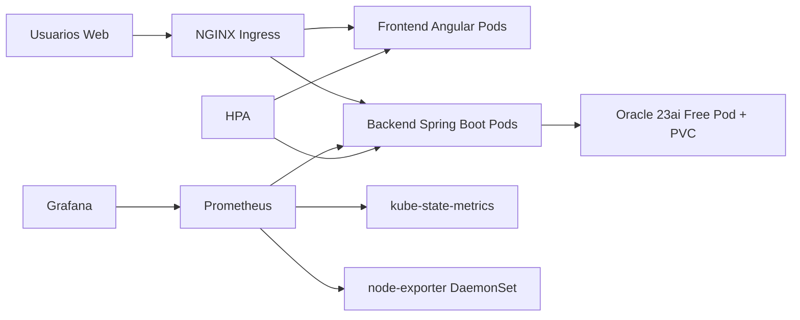

# Arquitectura Empresarial Airport Platform

## Componentes

- `frontend`: Angular 19, NGINX no-root, 2 replicas, HPA.
- `backend`: Java 21 Spring Boot 3, JWT, Actuator, Prometheus metrics, 2 replicas, HPA.
- `oracle`: Oracle Database 23ai Free con PVC persistente.
- `prometheus`: scrape de backend, pods, kube-state-metrics y node-exporter.
- `grafana`: dashboards de aplicación, cluster y nodos.
- `ingress`: dominios para app, Grafana y Prometheus.

## SRE

- Auto-healing con Deployments y probes.
- Escalamiento horizontal con HPA.
- Persistencia con PVC Oracle.
- Alertas Prometheus para pod caído, CPU/RAM alta, HTTP 500 y servicio caído.
- Scripts para simulación de fallas y reinicio controlado.
